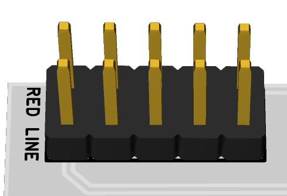

# XXX User Manual

*This is the web version of the manual. Click [here](Files/manual.pdf) for the PDF version.*

[TOC]

## 1 Introduction

### 1.1 Features

## 2 Power

This module requires XXXhp of free space in a rack. When installing, always turn off the power supply before plugging anything in. When plugging in the 10-16 pin ribbon power cable, ensure that the red stripe lines up with the **RED LINE** mark (refer to fig. 2.1) on the module and the marking that indicates **-12v** on the bus board. 

This module **is/is not** reverse polarity protected. This means that the module will not/will get heavily damaged if the power cable is plugged in backwards. However, a reversed power cable may still cause damage to the components in the module, as well as other modules connected to the same power supply. 

## 3 Front Panel Overview

## 4 Additional Information (Optional)

## 5 Patch Ideas

## 6 Technical Specifications

### 6.1 Dimensions & Power
|Width|Depth|+12v Current|-12v Current|
|-----|-----|------------|------------|
|||||

### 6.2 Inputs & Outputs
|Inputs|Additional Info|Outputs|Additional Info|
|------|---------------|-------|---------------|
|||||

### 6.3 Additional Specifications (Optional)