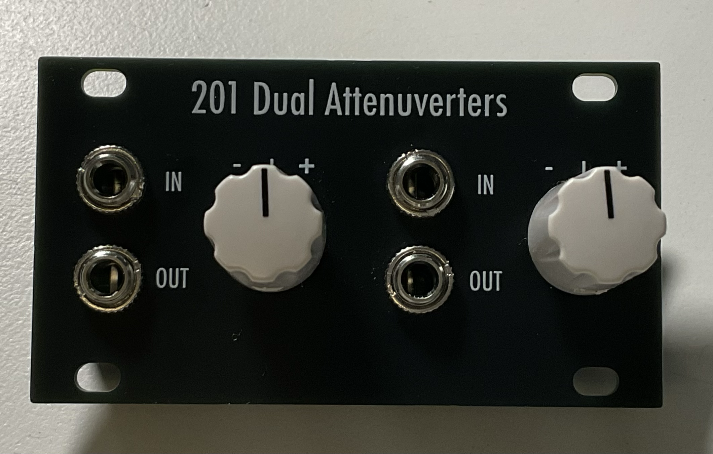

# 201 Dual Attenuverters

[TOC]

**This is the first module in the 2XX series of 1U utility modules**

*Dual Attenuverters*

# v0.1

## Specifications

|Parameter|Value|
|---------|-----|
|Width|14HP|
|Height|1U Intellijel|
|Depth|~15mm|
|+12 Current|-|
|-12 Current|-|
|+5 Current|0mA|

## Features

- Dual attenuverters each with an input, output and attenuvert knob

## Quirks and Problems

- none