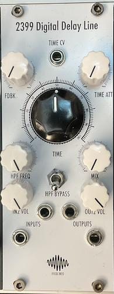

# 2399 Digital Delay Line

[TOC]

*Digital Delay Effects based on PT2399 Chip*

# Specifications

|Parameter|Value|
|---------|-----|
|Width|10HP|
|Depth|-|
|+12 Current|-|
|-12 Current|-|
|+5 Current|0mA|

# Features

- PT2399-based delay effect with wide range of delay times
- Two audio inputs and outputs to allow for feedback loops
- Time CV control with attenuator
- High pass filter & (high pass) bypass switch

# Quirks and Problems (v0.1)

- Adjusting input level for second input slightly affects the level of the first input
- High pass filter is routed the wrong way, so turning it clockwise will lower the cutoff point
- High pass filter does not cover the whole frequency range