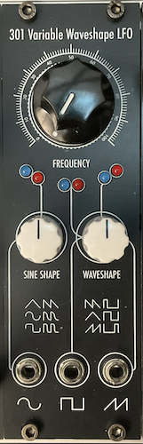

# 301 Variable Waveshape LFO

[TOC]

*Super Flexible Analogue LFO*

# v0.1

## Specifications

|Parameter|Value|
|---------|-----|
|Width|8HP|
|Depth|-|
|+12 Current|-|
|-12 Current|-|
|+5 Current|0mA|

## Features

- Three adjustable waveform outputs (sine, square, triangle)
- Sine can be overdriven and turned into smooth saw and ramp waves
- The pulse width of square can be adjusted
- Triangle wave can be turned to saw and ramp waves

## Quirks and Problems

- Replaced 100R resistor with 300R resistor
- Minimum frequency is 0 (could be good or bad depending on your needs)
- Actually works great!