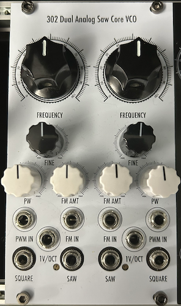

# 302 Dual Analog Saw Core VCO

[TOC]

*Dual Analog Saw Core VCOs based on Moritz Klein's Design*

# v0.1

## Specifications

|Parameter|Value|
|---------|-----|
|Width|14HP|
|Depth|~35mm max. *skiff friendly*|
|+12 Current|-|
|-12 Current|-|
|+5 Current|0mA|

## Features

- Dual Oscillator Design
- FM and PWM modulation inputs
- Good 1V/Oct capabilities over several octaves
- Coarse and fine tune frequecy knobs

## Quirks and Problems

- Fine tune knob is placed the wrong way