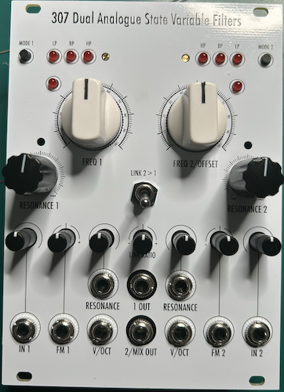

# 307 Dual Analogue State Variable Filters

[TOC]

*Flexible Smooth Dual SVFs*

# v0.1

## Specifications

|Parameter|Value|
|---------|-----|
|Width|18hp|
|Depth|-|
|+12 Current|-|
|-12 Current|-|
|+5 Current|-|

## Features

- Dual SVFs based on Thomas Henry's VCF-1 design
- VC resonance on both filters
- Resonance trimmer to tame maximum resonance
- VCF 2 can be linked to VCF 1, with attenuverter and offset to allow fine control
- Normalised single parallel dual filter that can be overwritten to a dual filter with mixed out when IN 2 is plugged in and dual single filters when OUT 1 is also plugged in
- V/OCT tracking capabilities
- Built in attenuators and attenuverters for all inputs

## Quirks and Problems

- it just doesn't work :C
- Input does not get output at all on both filters
- when cv is patched into FM of VCF 1 it produces a high pitched sinewave that is not affected by any knobs except for the input attenuverter
- Output selection works, until it fried the CD4017 chip on VCF2 (unknown reason, it still works on VCF1, perhaps I just accidentally connected the two boards wrong when testing leading to misaligned pins)
- Cutoff Frequency indication LED does not really light up, which is abnormal as they should at least light up when there is CV inputs
- Other features untested as the inputs are not output
- See story time in [308](/Eurorack/308-Voltage-Controlled-Filter-And-Wavefolder/#quirks-and-problems)