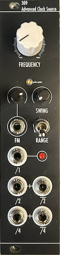

# 309 Advanced Clock Source

[TOC]

*High Range Clock Generator with Extra Features*

# v0.1

## Specifications

|Parameter|Value|
|---------|-----|
|Width|6hp|
|Depth|~35mm max. *skiff friendly*|
|+12 Current|-|
|-12 Current|-|
|+5 Current|0mA|

## Features

- Low/High frequency range switch with FM, allowing for use as a **non 1V/Oct** VCO
- Pulse duty cycle adjustable via calibration trimmer
- Swing capability with adjustment
- Built in /2 and /4 clock divider with respective inverted outputs

## Quirks and Problems

- Somehow the clock dividers only work with a duty cycle of ≥ 90%, which makes the main clock unusable
- Also, the output levels are too low, some other modules do not register triggers from it
- therefore, a redesign will be issued in the future