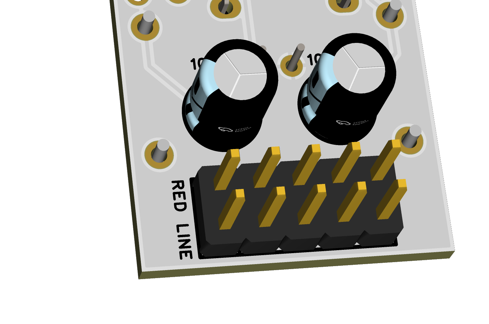
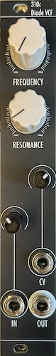

# 310c Diode Voltage Controlled Filter User Manual

*This is the web version of the manual. Click  for the PDF version.*

[TOC]

## 1 Introduction

The *310c Diode Voltage Controlled Filter* is a basic VCF based on the diode ladder topology in a small 4hp format. It is a two-pole lowpass filter, meaning it has a -12 dB/oct frequency response. 

## 2 Power

This module requires 4hp of free space in a rack. When installing, always turn off the power supply before plugging anything in. When plugging in the 10-16 pin ribbon power cable, ensure that the red stripe lines up with the **RED LINE** mark (see fig. 2.1) on the module and the marking that indicates **-12v** on the bus board.

This module **is** reverse polarity protected. This means that the module will not get heavily damaged if the power cable is plugged in backwards. However, a reversed power cable may still cause damage to the components in the module, as well as other modules connected to the same power supply. 

*fig. 2.1 Power Header*

## 3 Front Panel Overview

*fig. 3.1 Panel Overview*

The 310c has a common and straightforward interface similar to many VCF designs. The cutoff *FREQUENCY* knob allows for sweeping across the full frequency range (20-20,000 Hz) , and the *RESONANCE* knob allows for control of resonance from completely zero up to self-oscillation (at about 2-3 o’clock) and overdriving self-oscillation. The resonance intensity can be adjusted, refer to Section 4.1.

The audio *IN* and *CV* inputs both accept standard Eurorack signal levels of up to 24Vpp, and can be attenuated using their respective onboard attenuators, indicated by the panel. The *IN* attenuator can be used to overdrive the input signal when fully open, which will decrease the effect of resonance and result in a soft-clipped output signal. *CV* is capable of tracking 1 V/oct for around 2-3 octaves, depending on the attenuator position. To achieve this, the attenuator should be set at about 1-3 o’clock, the exact position also depends on the *FREQUENCY* knob position. 

Finally, the jack below the *CV* input is *OUT*, which is the output of the filter. 

## 4 Additional Information

### 4.1 Resonance Intensity Adjustment

### 4.2 Frequency Response

The intensity of the resonance can be adjusted via a trimmer potentiometer at the bottom PCB of the module. To adjust it, First turn the **FREQUENCY** knob to the central (12 o’clock) position and the **RESONANCE** knob to the maximum position, and plug a cable to **OUT** to monitor the output of the module. Next, remove the module from the rack and locate the resonance trimmer on the bottom PCB (see fig. 4.1). Using a small flathead screwdriver, adjust the frequency trimmer to your liking. The output of the resonance will be the resonance of the module with maximum resonance. 

**Warning:**
a.	High resonance intensity can result in very high levels. Be careful to not damage hearing or speakers. 
b.	Touching the PCB while adjusting the trimmer **will** cause instabilities in the module. While it won’t cause damage in the module, but will make adjustment more difficult. It is recommended to hold the panel or place the module upside-down on the rack (see fig 4.2) while adjusting. 
c.	**Do not** allow contact from any metal with the PCB, as it may cause damage to the circuit. 

## 5 Patch Ideas

## 6 Technical Specifications

### 6.1 Dimensions & Power
|Width|Depth|+12v Current|-12v Current|
|-----|-----|------------|------------|
|*8hp*|*~35mm max.*|||

### 6.2 Inputs & Outputs
|Inputs|Additional Info|Outputs|Additional Info|
|------|---------------|-------|---------------|
|**IN**|*±12V max.*|**OUT**|*~20Vpp max.*|
|**CV**|*±12V max.*|||

### 6.3 Additional Specifications (Optional)