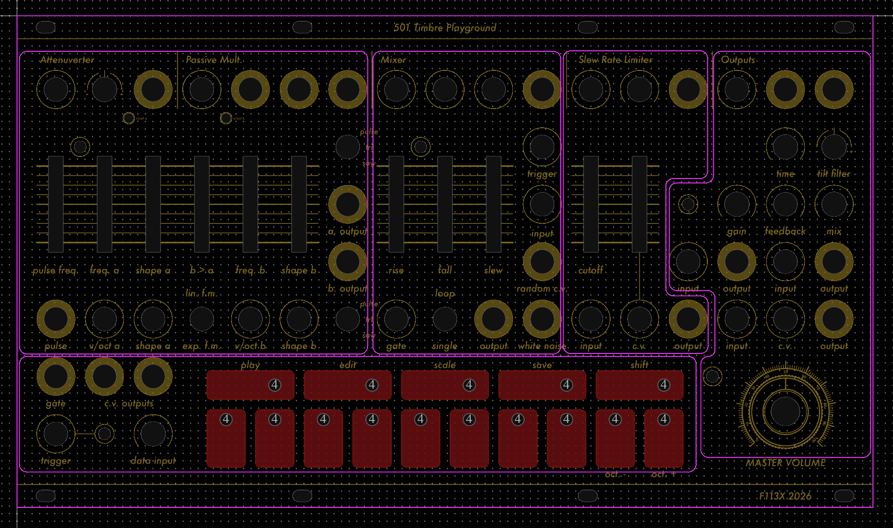
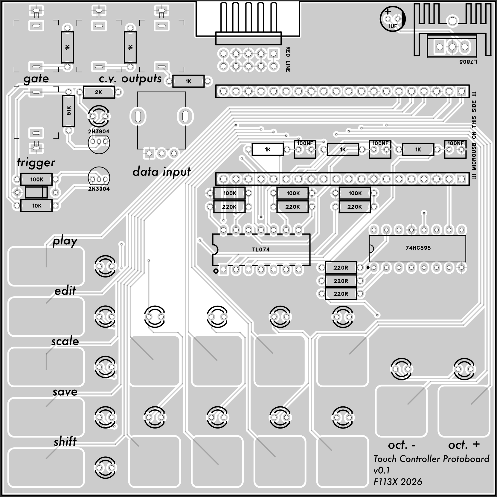
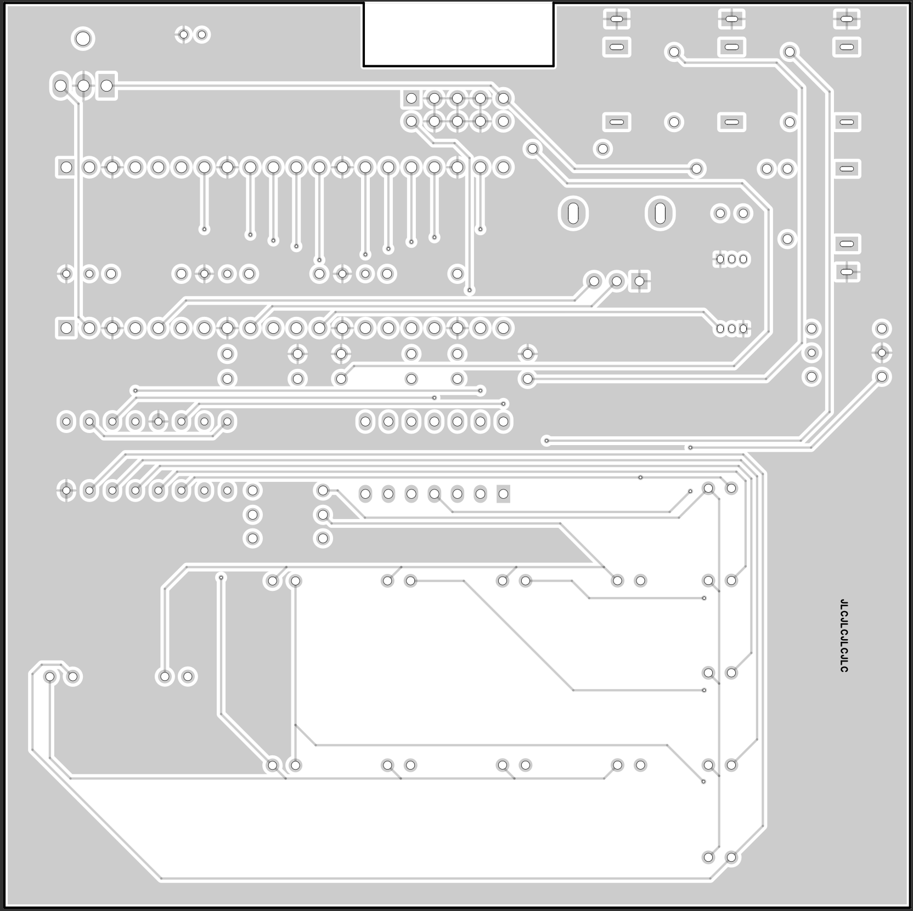

# 501 Timbre Workshop

[TOC]

*Semi-Standalone Synth Voice*

# Foreword

This module is the start of the 5XX series modules. Unlike the other modules, this series contain full synth voices that can be used as standalone or semi-modular synths. This module is said to be "semi-standalone" as it is still designed as a Eurorack module and requires a standard case and ±12v powersupply. I might make it into a standalone unit in the future, but that may still take some time. 

Currently, the module is style in the early prototype stage, and each functional unit is divided in seperate boards to decrease costs, increase success rate, and improve debug-ability. This means that it is relatively difficult to add normalled connections across the functional units, so it is still a fully modular synth. However, if all goes smoothly, the final model may be semi-modular and do not require patching to play. Also, this page will be seperated into each of the functional units for ease of documentation. 

Finally, this module is highly inspired by the Buchla Easel. It can be seen from the functions and layout, and I have been inspired by the east coast paradigm in general while coming up with this design. With that said, there is no guarantee that the module sounds, behaves, or plays like the Easel, as there will likely be no circuitry from the Easel used in this module. I have never played the Easel before, so I would never know if they are similar or not. There are also several funtions that the Easel has but this lacks, as well as others that this has and the Easel lacks. 

# Specifications

|Parameter|Value|
|---------|-----|
|Width|-|
|Depth|-|
|+12 Current|-|
|-12 Current|-|
|+5 Current|-|

# Unit Layout

Please note that exact panel functions are due to change, some of the labels are outdated and the image is only to be used as a visualisation of how the PCBs for each functional units will be layed out underneath the panel. 

# Oscillator Unit

status: undesigned, unbuilt

*Complex Oscillator Along with a Clock Generator*

## v0.1

### Features

- Dual sine/square oscillators with linear and exponential cross fm
- "Tone" controls wavefold level on sine and pulse width on square
- Simple clock source with pulse output
- Utility attenuverter and passive multiple 

### Quirks and Problems

-

# Function Generator Unit

status: undesigned, unbuilt

*Classic Loopable AD/AR Generator and S&H with noise and slew*

## v0.1

### Features

- Loopable AD/AR generator based on the 555 timer chip
- S&H based on the S&H chip with built in noise generator and slew
- Utility 3 input CV/Audio mixer

### Quirks and Problems

-

# Filter Unit

status: mainboard designed, topboard under progress, unbuilt

***Non Resonant****VCF based on Rene Schmitz Late MS20 Design*

## v0.1

### Features

- MS20 lowpass VCF without resonance
- A utility slew rate limiter

### Quirks and Problems

-

# Output Unit

status: undesigned, unbuilt

*Multifunctional Unit Containing Effects, Utilities, and the Master Out*

## Touch Controller Protoboard

*This board is for prototyping the current touch controller design, it has identical features, just a layout optimised for testing and programming the device.*

## v0.1

### Features

- PT2399 Delay line with in-built tilt filter on delayed signal
- Overdrive with clipping indicator LED
- Vactrol based LPG
- Dual stereo line-outs with mono in

### Quirks and Problems

-

# Keyboard Unit

status: Prototype board is designed and software currently under development

*Digitally Driven Touch Controller with Built-in Sequencers, Quantisation and more*

## v0.1

### Features

- 15 button capacitive touch pads, 2 CV outs and 1 gate out (gate out can technically output CV)
- Raspberry Pi Pico driven core, the limiting factor is the hardware (you can program it to do anything as long as it works on the hardware), so sequencers, arpeggiators, polyphony is all technically possible
- Actual software features tbd

### Quirks and Problems

-