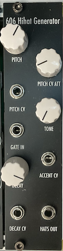

# 606 Hihat Generator

[TOC]

*Hihat Generator based on Moritz Klein's Design*

# Specifications

|Parameter|Value|
|---------|-----|
|Width|6HP|
|Depth|-|
|+12 Current|-|
|-12 Current|-|
|+5 Current|0mA|

# Features

- Authentic 606/x0x style Hihat
- Manual and CV control over Pitch
- Bridged-T bandpass filter as Tone
- CV control over Delay
- Accent CV as offset for internal VCA

# Quirks and Problems (v0.1)

- Pitch adjustment sounds weird, and FM is also weird
- Decay can only be adjusted with a dummy cable connecting to the Decay CV input
- Hihat sound has a lot of low end, frequency of high pass filter is not high enough