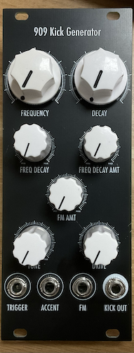

# 909 Kick Generator

[TOC]

*Kick Generator based on Moritz Klein's Design*

# v0.1

## Specifications

|Parameter|Value|
|---------|-----|
|Width|8hp|
|Depth|~15mm *skiff friendly*|
|+12 Current|-|
|-12 Current|-|
|+5 Current|-|

## Features

- Authentic 909/x0x style Kick
- Manual and CV control over Pitch
- Tone and Drive controls for a variety of kick flavours
- Decay for frequency and amplitude
- Accent CV as offset for internal VCA

## Quirks and Problems

- Untested, currently missing a few components