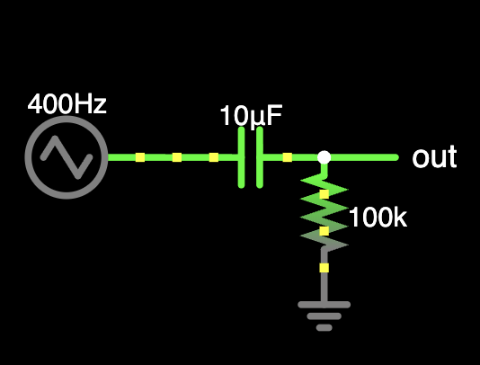

# RC Filters are amazing

I just want to express my appreciation to RC filters, because after trying to develop some new stuff, I just discovered that RC filters are at the core of so many circuits.

Slew rate limiters? Basically RC lowpass filters where the cutoff frequency is very low.

Minimoog style ADSR envelopes, gated AD/AR envelopes
Basically bidirectional slew rate limiters (check above!)

I was learning how envelope looping works using a inverting schmitt trigger, and it looked suspiciously like the 40106 square/triangle oscillator. Lo and behold, they are basically the same thing!

Therefore, at the heart of the one of the most common starter DIY synth projects: a RC lowpass filter!

Now lets talk about RC highpass filters.

AC coupling a RC highpass filter (technically cutting off the 0Hz signals or in other words, the DC offset)

Gate to trigger converter? Basically just a RC highpass filter with the negative voltages cut off by a diode, then going through a comparator to square things off.

And not to mention all of the actual audio filters that are RC filters at there core (basically all of them except for the crazy people who use LC filters or other weird stuff XD)