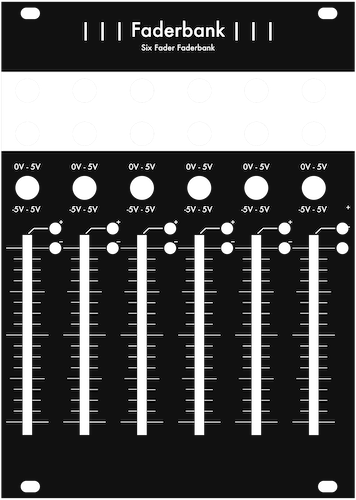

# Faderbanks

[TOC]

*A series of macro faders with different channel numbers*

# 6ch

## Specifications

|Parameter|Value|
|---------|-----|
|Width|18HP|
|Depth|-|
|+12 Current|-|
|-12 Current|-|
|+5 Current|0mA|

## Features
- 6 channels of macro faders
- Toggleable +5v unipolar/±5v bipolar output voltage
- Two outputs per channel
- Bipolar LEDs to visualize output

## Quirks and Problems
- not built yet