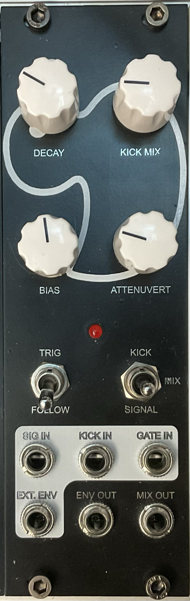

# VCA Duck

[TOC]

*Simple and Flexible Solution for Kick Sidechaining, Based on sdiy Luther's Design*

# v0.1

## Specifications

|Parameter|Value|
|---------|-----|
|Width|10HP|
|Depth|~35mm *skiff friendly*|
|+12 Current|-|
|-12 Current|-|
|+5 Current|0mA|

## Features

- Seperate inputs for Kick track and all other tracks
- Switchable envelope follower/internal envelope for VCA modulation with indicator LED
- Selectable Kick/Signal/Mix output
- Gate in to manually trigger envelope
- External envelope input and envelope output
- Decay control for internal envelope and envelope follower
- Crossfading bias control for signal and kick tracks
- Controllable kick volume
- Attenuate and attenuvert the envelope for different amounts of VCA modulation

## Quirks and Problems

- Works very well
- Envelope out is before the attenuverter, so the signal is always positive (not neccessarily a problem, but is good to know)