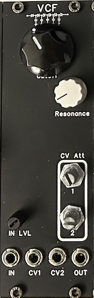

# VCF-1

**A new version using (practically) the same circuit has been made [here](https://f113x.github.io/projects-documentation/Eurorack/310c-Diode-Voltage-Controlled-Filter/), consider checking it out!**

[TOC]

*Smooth Diode Ladder Based Low Pass Filter*

# v0.1

## Specifications

|Parameter|Value|
|---------|-----|
|Width|8hp|
|Depth|~15mm *skiff friendly*|
|+12 Current|-|
|-12 Current|-|
|+5 Current|0mA|

## Features

- Solid diode ladder filter topology, smooth filter sweeps
- Two CV inputs and attenuators to modulate cutoff frequency
- Input level adjustment to allow for overdriving filter circuit

## Quirks and Problems

- Resonance knob is backwards
- Resonance control isn't very sensitive, one small movement may go from no resonance to harsh self oscillation
- CV attenuator does not attenuate the full range